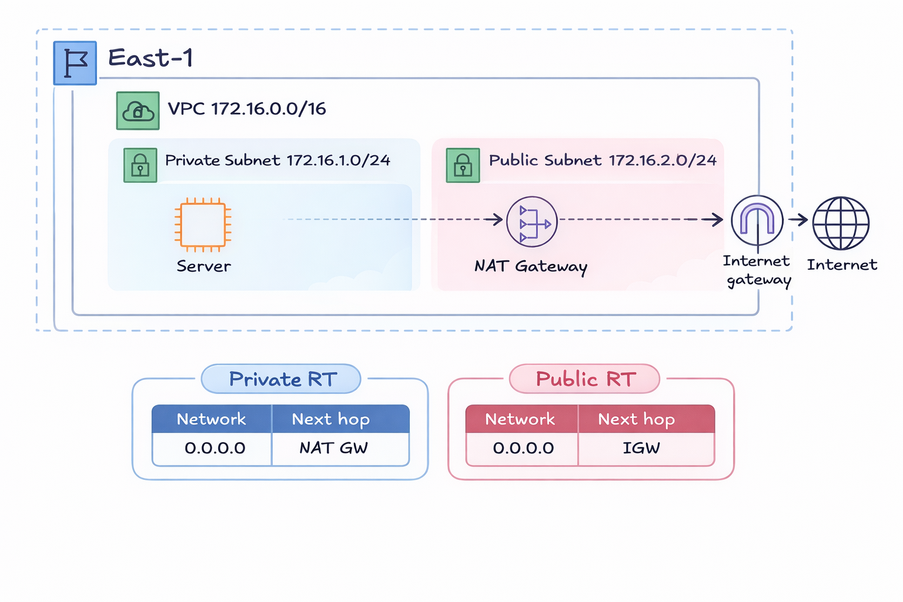

# Terraform AWS VPC Lab

This repository contains a hands-on Terraform lab for building a basic AWS infrastructure on Amazon Web Services (AWS).

The project uses Terraform to create the infrastructure automatically instead of creating everything manually through the AWS Console.

An additional refactored version of this project was also built using **modules and variables**, and it is available in:

- `./existing-project-refactored-with-modules-and-variables`

## Architecture Diagram

---

# Project Overview

This lab builds a simple AWS network architecture that includes:

- VPC
- Public Subnet
- Private Subnet
- Internet Gateway
- NAT Gateway
- Elastic IP
- Public Route Table
- Private Route Table
- Route Table Associations
- Default Security Group
- EC2 Instance inside the Private Subnet

The goal is to understand how Terraform can provision cloud infrastructure in a structured and repeatable way.

---

# Lab Guide and Official References

The full step-by-step lab explanation is available in:

- `terraform-lab-hands-on.md`

Official references used in this project:

- [Terraform AWS Getting Started Tutorial](https://developer.hashicorp.com/terraform/tutorials/aws-get-started)
- [Terraform AWS Provider Documentation](https://registry.terraform.io/providers/hashicorp/aws/latest/docs)

These references are useful for understanding resource arguments, configuration examples, and Terraform best practices.

---

# Network Design

The network flow is:

~~~text
Public Subnet  -> Route Table -> Internet Gateway -> Internet
Private Subnet -> Route Table -> NAT Gateway -> Internet Gateway -> Internet
~~~

The EC2 instance is deployed inside the private subnet and does not receive a Public IP.

# Project Files

~~~text
terraform-aws-vpc-lab/
├── README.md
├── terraform-lab-hands-on.md
├── provider.tf
├── main.tf
└── images/
    └── diagram.png
~~~

# Terraform Files

## provider.tf

Contains:

- Terraform version
- AWS provider
- Provider version
- AWS region

## main.tf

Contains all AWS resources used in the lab.

# Basic Terraform Commands

Initialize Terraform:

~~~bash
terraform init
~~~

Preview changes:

~~~bash
terraform plan
~~~

Create infrastructure:

~~~bash
terraform apply
~~~

Delete infrastructure after finishing:

~~~bash
terraform destroy
~~~

# AWS Credentials

Configure AWS credentials before running Terraform:

~~~bash
aws configure
~~~

Or use environment variables:

~~~bash
export AWS_ACCESS_KEY_ID=...
export AWS_SECRET_ACCESS_KEY=...
~~~

Do not place credentials directly inside Terraform files.

# Learning Goals

By completing this lab, you will understand:

- Infrastructure as Code (IaC)
- Terraform workflow
- Terraform resource dependencies
- How to create and destroy infrastructure safely

# Important Note

Always delete resources after testing to avoid unnecessary AWS costs.
